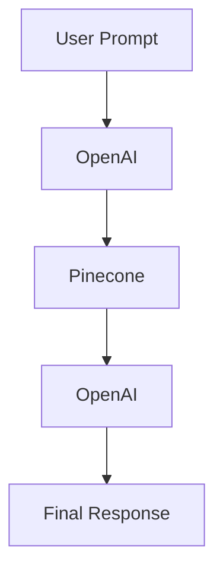

# Developer Sandbox

Welcome to the SynapseStack sandbox. Use the YAML editor below to modify a pipeline and instantly preview the Mermaid graph.

> This interactive tool allows you to experiment with `pipeline.yaml` before installing the CLI.

<!-- Embed a React component or iframe here in future -->

```yaml
pipeline:
  name: try-me-pipeline
  embedder: OpenAI
  vectorStore: Pinecone
  llm: OpenAI
```


